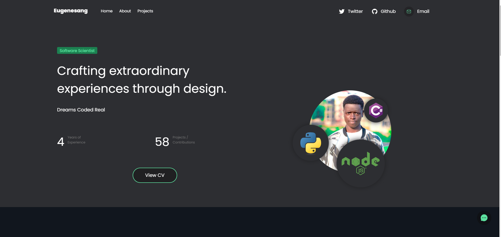

# Portfolio - **Built version**



View the page at [eugene-sang.web.app](https://eugene-sang.web.app)

This is a complied version of [the raw portfolio](https://github.com/eugenesang/portfolio)

## Technologies

- React
- Firebase
- GitHub
- Node.js
- npm

## Prerequisites

- CLI environment
  - Window `Command Prompt` or `Powershell`
  - Linux `Terminal`
  - Mac `Terminal`
- Firebase account [firebase.com](https://firebase.google.com)
- Firebase active project
- [Node.js](https://www.nodejs.org)
  
  ```sh
  node --v
  ```

- npm - bundled with nodejs

    ```sh
    npm --v
    ```

## Deployment

After creating a web project in firebase,

1. Go to project settings
2. Scroll down to **SDK setup and configuration**
3. Select the **CDN** radio button
4. Copy the code provided excluding the script tags
5. Paste that code to [script.js](./script.js)

### Building React App

We have the source code for our built app at [Eugene Sang - Portfolio](https://github.com/eugenesang/portfolio).

1. Clone the project

    ```sh
    git clone https://github.com/eugenesang/portfolio.git
    ```

    or

    [download it from github](https://github.com/eugenesang/portfolio)

2. Navigate to the project folder

    ```sh
    cd portfolio
    ```

3. Install packages

    ```sh
    npm install
    ```

    or

    ```sh
    yarn install
    ```

4. Customise your portfolio.
5. Test it in local dev

    ```sh
    npm start
    ```

6. If everything works. Everything looks good. Build the app

    ```sh
    npm run build
    ```

7. The build version of the app will be in the folder  `./build`

### Preparation of files for deployment

1. Delete everything in this folder except [script.js](script.js)
2. Copy the content of the build folder to this folder.
3. Edit the head of [index.html](index.html) to include

    ```html
    <script type="module" src="./script.js" defer></script>
    ```

4. Test the code using live server

    ```sh
    live-server . --port=8080
    ```

5. Use you browser dev tools to test the app.

### Deploy to firebase

1. Install the Firebase `CLI` if you haven't already via npm by running the following command:

    ```sh
    npm install -g firebase-tools
    ```

2. Log into Firebase using your Google account by running the following command:

    ```sh
    firebase login
    ```

3. Initialize a firebase project and follow the instructions provided. We only need analytics for this app, you may select only that

    ```sh
    firebase init
    ```

4. Deploy

    ```sh
    firebase deploy
    ```

***Note*** you can get more instructions from [firebase official docs](https://firebase.google.com/docs/cli)

Congratulations! You are now live.
